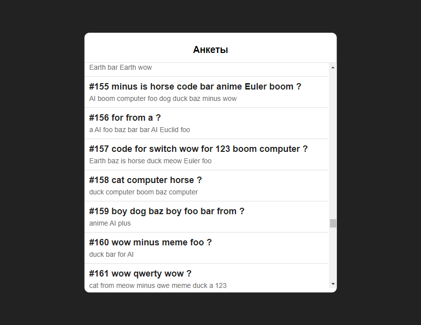
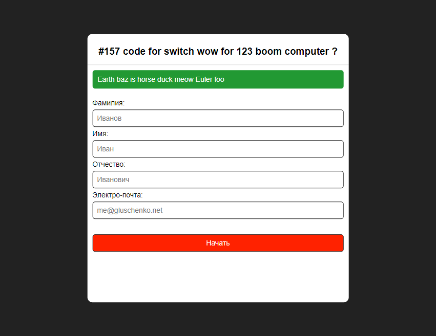
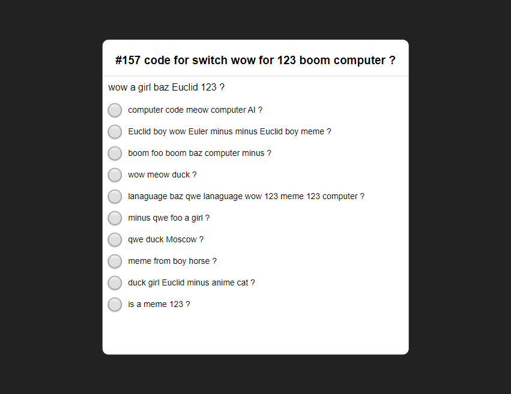
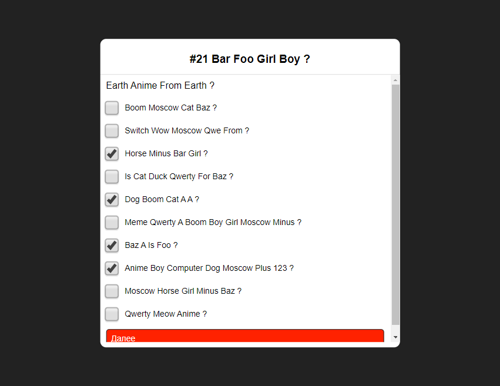
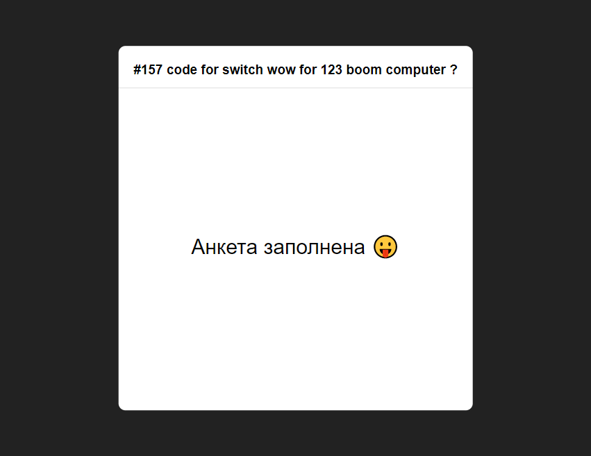

## Introduction

NanoSurvey — сервис, предоставляющий 
простой API для сбора сведений об опросах.

#### Структура

`NanoSurvey` — приложение ASP.NET Core (по умолчанию: localhost:5024).

`NanoSurvey.Common` — библиотека .NET Standard, предоставляющая 
контекст, расширения коллекций и схемы сущностей базы данных.

#### Требования

* ASP.NET Core `>= 3.1.1`
* MS SQL Server `>= 2019`
* Microsoft.EntityFrameworkCore `3.1.2`
* Microsoft.EntityFrameworkCore.SqlServer `3.1.2`
* Microsoft.EntityFrameworkCore.Tools `3.1.2`

## API

Методы  API принимают запросы строго определенной структуры и строго заданного формата данных. 
В свою очередь, API предоставляет однозначный и строго формализованный ответ.

Формат запроса к API: [POST] /api/[section]/[method] 

*Ответ об успешном выполнении (JSON):*

    {
        response: {
            <объект ответа>
        }
    }

*Ответ об ошибке (JSON):*

    {
        error: {
            error_msg: "Example message",
            request_params: {  # Параметры запроса клиента
                param1: "value1",
                param1: "value2",
                param1: "value3"
            }
        }
    }

**При наличии нескольких сообщений `error_msg` будет возвращен в виде массива*

## API Methods

### Секция Surveys 

Содержит меминимальный набор методов для работы с анкетами (✔ - ТЗ).

#### Метод surveys/get

Возвращает объект анкеты, либо ошибку.

* `id` `int` — идентификатор анкеты

#### Метод surveys/getQuestion ✔

Возвращает объект очередного вопроса вопроса.

* `id` `int` — идентификатор текущей анкеты
* `previous` `int` — ID предыдущего вопроса текущей анкеты (или ноль)

#### Метод surveys/saveResult ✔

Сохраняет, либо обновляет результат ответа на вопрос пользователем.

* `interviewID` `int` — идентификатор сессии
* `questionID` `int` — идентификатор текущего вопроса
* `value` `int` — значение, которое нужно сохранить

#### Метод surveys/getList 

Возвращает список объектов анкет.

* `count` `int` — количество
* `start` `int` — идентификатор последней анкеты в предыдущем запросе (в список включен не будет)

### Секция Interviews

Содержит минимальный набор методов для работы с пользовательскими сессиями.

#### Метод interviews/save

Размещает в базе данных информацию о текущей пользовательской сессии.

* `survieyID` `int` — ID анкеты
* `firstName` `string` — имя
* `lastName` `string` — фамилия
* `middleName` `string` — отчество, либо вторая фамилия
* `email` `string` — почта

**Имена и адрес почты водвергаются проверке формата и органичены по длине*

## Database

Структура БД: data/database_scheme.sql

Данные для БД: data/database_data_only.sql (67 MB)

Также БД можно автоматически забить рандомными данными: http://localhost:5024/fill/[количество_анкет]

## Скрины

Для упрощения тестирования руками был реализован фронт на коленке.

